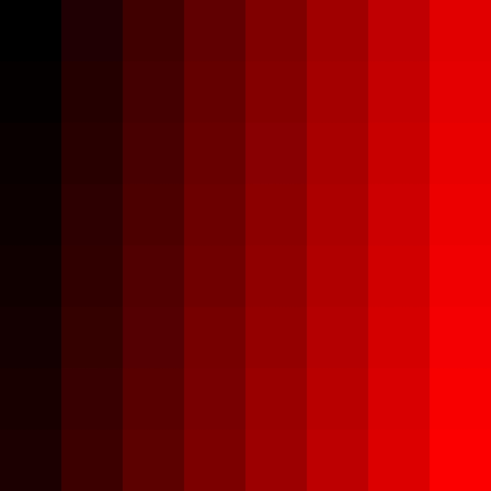

# Digital-image-processing
Assignments for 2018 winter Software.

Check file folder for details.

This project finally is a **c++ toy image processing library** based on GDAL. It package image as a class, then offer some method to do some operation conveniently, such as convolution, modification pixel by pixel, etc.

## Usage

For using this library, just simpley include  "Pic.h" and GDAL.
See the example:

```
#include "stdafx.h"
#include "Pic.h"
#include <iostream>

using namespace std;

int _tmain(int argc, _TCHAR* argv[])
{
	char *dst_path = "ans_example.tif";
	int x = 0;

	LargePicture* im_fus = new LargePicture(1000,1000,3,0,4,dst_path);
	Pixel ***_fus = im_fus->getPic();
	
	float val = 0;
	do{
		for(int i =0; i < im_fus->blockXlen;i++){
			for(int j =0; j < im_fus->blockYlen;j++){
				_fus[i][j]->set(0,x);
			}
		}
		im_fus->update();

		val += 5;
	}while(im_fus->next());
	
	Picture tmp(dst_path);
	tmp.save("example.jpg","JPEG");

	system("PAUSE");
	return 0;
}
```



