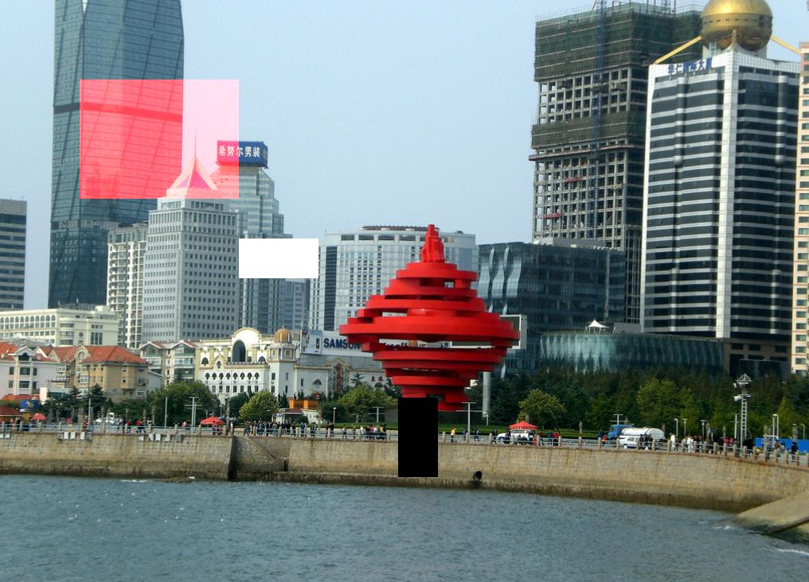

2nd Task: Pixel level modification
===========

[[toc]]

## Set red channel of designated area to 255

Step0. Same as 1st Task, copy a duplication as target image.
// Step1. Load channal one of the area from source image into buffer . (for this subtask this step is optional, same as below.)
Step2. Set buffer to 255 all.
Step3. write to the same area and same channal in target image with the buffer.

## Set designated area to white or black

Just set three channal of designated area to 0 (black) or 255(white) then write to the target image.

## Some problem

I don't make sure how GDAL process storage manage, so I reapply the buffer when finish a subtask with CPLFree(buffTmp) and CPLMalloc().

GDAL can generate JPG file through copy from memory. So I just process image by using GetDriverByName("MEM") in memory, then output to .jpg file.