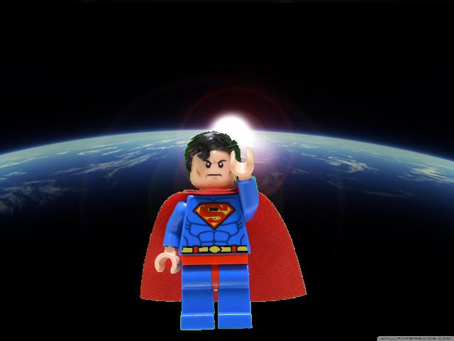
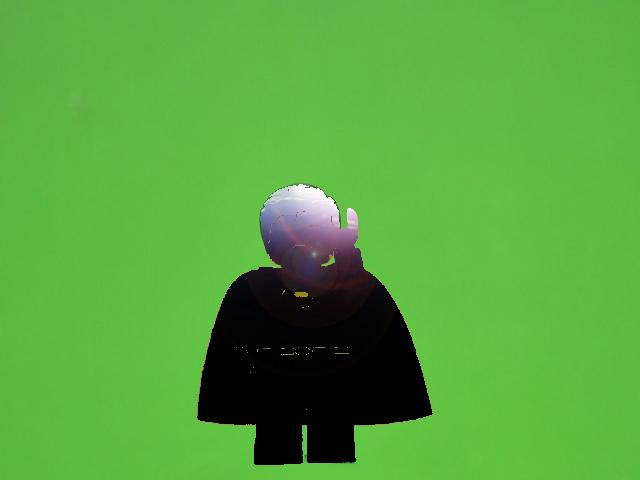

3rd Task: Cutout
===========

[[toc]]

## Pic.h

I package the Pixel Class and Pictrue Class in Pic.h.

+ `Class Pixel`
	
	Pixel Special for three channal  Picture. Maybe extend to kind of Pixel with arbitrary channal in future.
	
	+ Pixel(const unsigned short _r=0, const unsigned short _g=0, const unsigned short _b=0);
	+ bool set(Pixel *p)；
	+ bool set(const unsigned short channal, const unsigned short n)
	+ bool getR()；
	+ bool getG()；
	+ bool getB()；
	+ bool getBand(const unsigned short channal)；

+ `Class Picture`

	+ bool existFile(const char *_path)；
	+ Picture(const char *_path = nullptr)；
	+ unsigned short getXlen()；
	+ unsigned short getYlen()；
	+ unsigned short getBandNum；
	+ Pixel ***getPic();
		+ return a matrix M of the picture; This hugely improve the experience of image processing.
	+ bool modify();
		+ apply changes in M to duplication of the picture;
	+ bool save(const char* dstPath, const char* format="JPEG");

## Cutout

* * *

## Some problem

Though the tutorial instructs that pixels satisfy **10<r<160 & 100<g<220 & 10<b<110** are the superman, in fact I choosed the pixels with condition **! (10<r<160 & 100<g<220 & 10<b<110)** and got the right result, and follow was the output with former condition.

