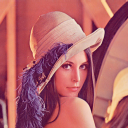
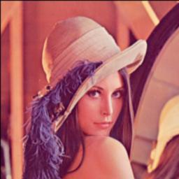
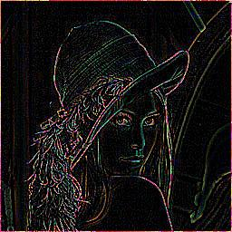
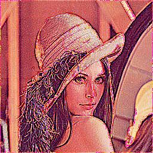
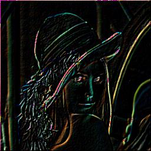

3rd Task: Cutout
===========

[[toc]]

## Pic.h V 2.0

I added various function into Pic.h and imporved its efficiency. 

+ `Class Pixel`
	
	Pixel Special for three channal  Picture. Maybe extend to kind of Pixel with arbitrary channal in future.
	
	+ bool set(const Pixel p)；
	+ bool add(const Pixel *p);
	+ bool add(const Pixel p);
	+ Pixel muti(float f)const；
	+ bool cutOff()；
	+ void print()const ；

+ `Class Picture`

	+ Pixel getPixel(const short x, const short y)const；
	+ **bool Cov(Kernel *k)**；

And added the Kernel class, using 2-dimension array as Matrix is extremely unconvinient in C++, So I use STL assistantly construct the class.

+ `CLass Kernel`

	+ Kernel(unsigned short _Xlen=1, unsigned short _Ylen=1, float **_M=nullptr);
	+ Kernel(vector<vector<float> > _M);
	+ bool set(float **_M = nullptr);
	+ unsigned short getXlen()const;
	+ unsigned short getYlen()const;
	+ float getScale(const short x,const short y)const;

Check the file for more details. 

BTW, pointer is such an anti-human stuff, it drive me crazy.

## Results

 			
		

* * *

## Some problem

Lots of pointer things.

I cut off the value of a pixel into [0,255] every add or mutiply operation, which is a fatal error that cause the disaster. Actually, when running the convolution, cut ing off should be carryed after all elements summed up. 

